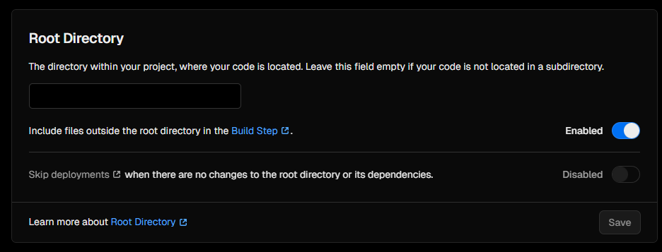
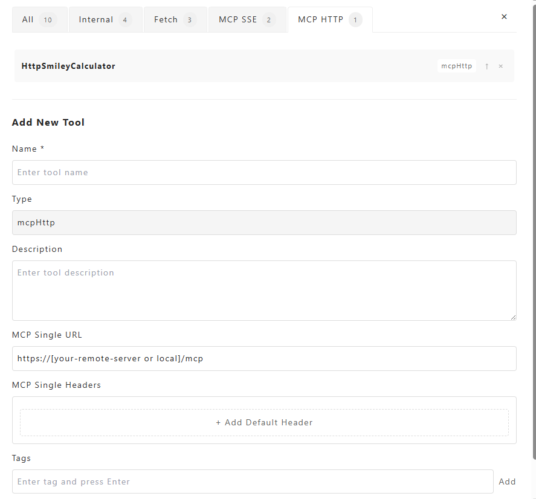
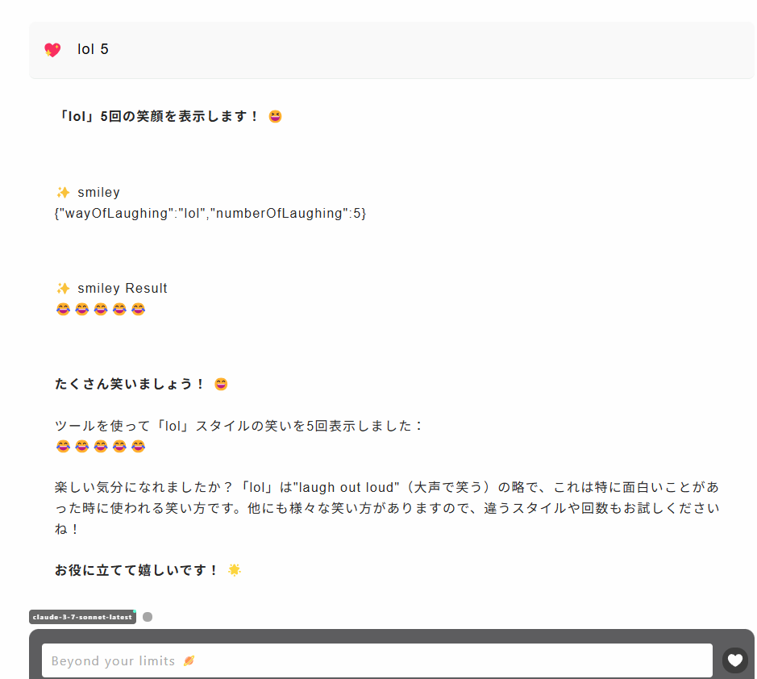

# mcp-streamable-http-demo

## Setup

```
rename .env.example to .env

pnpm install
pnpm dev:server //localhost:3000
pnpm dev:client
```

## Deploy on vercel

```
pnpm vercel:login // choose root directory /
pnpm dev:vercel
pnpm deploy:vercel
```

Root Directory /




## Test remote endpoints

modify .env 

MCP_SERVER_URL=https://[YOUR_SERVER_ADDRESS]

then, `pnpm dev:client`


## Use in Sugoi Search

Set https://[your-remote-server or local]/mcp endpoint




## Client Example in Sugoi Search

